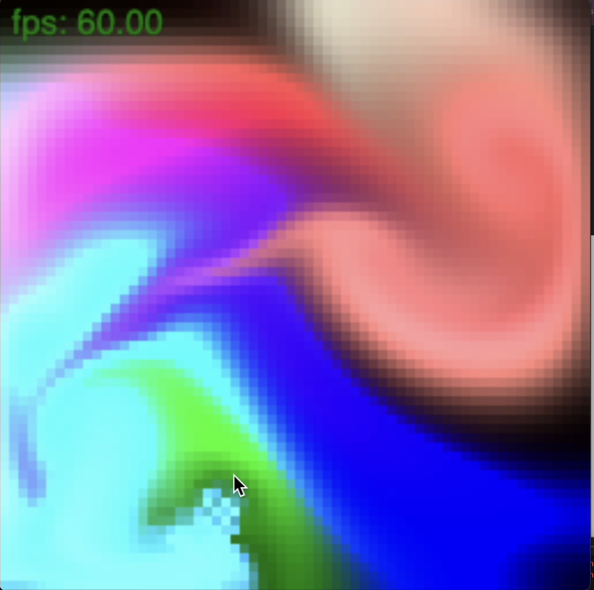

# Readme

This repo contains the code for my final project for Math 449: Scientific Computing. Contained is an implementation and some simple demos of the Stable Fluids simulation introduced by Jos Stam in 1999.

- _Live Demo:_ https://sbobyn.github.io/Math-449/

# Build Instructions

To build and run locally, run the following commands

- `make dist` or simply `make`
- host the project on a local server
  - suggestion:
    - open the project in VS Code
    - use the VS Code extension https://marketplace.visualstudio.com/items?itemName=ritwickdey.LiveServer and run the command "Live Server: Open with Live Server" from the VS Code command palette with

Requirements:

- the only requirement is TypeScript. Ensure node is installed and run `npm install typescript --save-dev`
  - https://www.typescriptlang.org/download

# Simulation Controls

- _Right click:_ add smoke to a simulation
- _Left click and drag:_ change the velocity field
