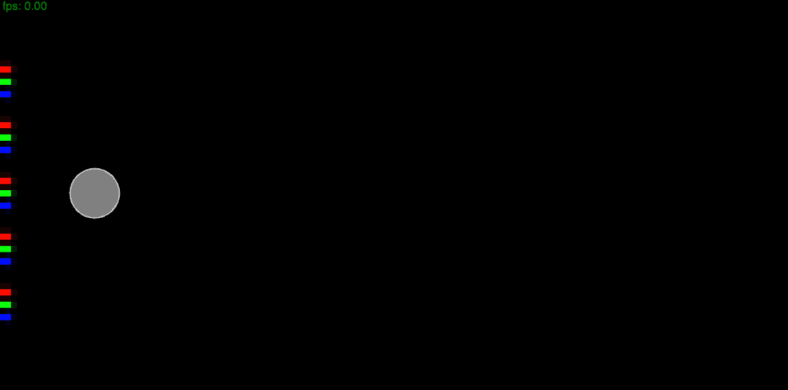

# Stable Fluids

This project is a simple Eularian fluid simulator based on Jos Stam's [Stable Fluids](https://pages.cs.wisc.edu/~chaol/data/cs777/stam-stable_fluids.pdf) Method.

The implementation closely follows the one described in the paper [Real-Time Fluid Simulation for Games](http://graphics.cs.cmu.edu/nsp/course/15-464/Fall09/papers/StamFluidforGames.pdf).

The implementation is written entirely in TypeScript on the CPU and rendered with the HTML canvas API (no shaders used for rendering or the fluid solving) so the resolution of the simulation is limited but still enough for interesting results.

A demo for the project is available here https://github.com/sbobyn/stable-fluids.ts.

# Demos

## RGB Smoke Dyes

## Wind Tunnel

## Vector Field

# Follow ups

- GPU based solver with WebGL shaders + fast rendering with simple frag shader
- 3D
- more methods
  - vorticity confinement
  - Hybrid methods (PIC, FLIP, APIC, Poly PIC)
  - SPH
  - level sets for surface reconstruction
  - DL-based
